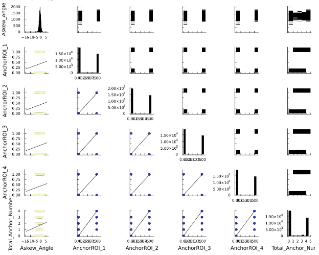

## Introduction {.page_break_before}

Railroad tracks have four main components: rail, ties, fastening systems, and ballast. The rail is the main component that supports the loads transmitted by the trains. The fastening system is responsible for fastening the rail to the ties and keeping the rail in a proper position. Fastening systems are made of spikes, tie plates, anchors, and sometimes clips. The ties are the interface between the rails and ballast. The two main materials used for ties in the United States are timber and concrete. The last layer on the railroad superstructure is the ballast. Its main functions are to spread the loads on the ground and to provide proper drainage for the track system. 

These components are inspected using the LRAIL technology that combines 2D imagery and laser triangulation to assess the health and condition of each component. The collected data is processed through a DNN (Deep Convolutional Neural Network) model that identifies and classifies the components. This technology has been used under the scope of research led by the RailTEC group at UIUC, funded by the FRA-DOT with two Class I railroads in the US. The output of this technology, which will be used in this project, is described in an Excel file (filename: Datasets) attached to this proposal and Table @tbl:data_description. 

Track geometry can be defined as the relative position of the rails. The common measurements are related to horizontal and vertical irregularities, gage, and superelevation. CFR 213 establishes safety limits that must be kept in order to provide the trains with a safe ride.
Railroads use laser-based contactless systems to measure track geometry. Recently these systems have been installed in boxcars and locomotives to provide autonomous measurements, reduce inspection costs, and collect more data. Geometry cars, as they are called, collect measurements of each foot of the track to calculate the deviations.

The purpose of this project is to look for relationships between components’ health and geometry data collected over the same tracks in a short period and to identify possible correlations. The approaches of this project consist of but are not limited to EDA methods, regressions, and correlation models. The data can be found in [Project](https://uillinoisedu-my.sharepoint.com/:f:/g/personal/arthurc4_illinois_edu/Eh9aZN9IoCJHvQiN_xHw2K0BBja-OZrkBTgf1JRtKFdTUw?e=yHjPx7) , “LRAIL” contains the component health conditions,  “Geometry 1” and “Geometry 2” include the geometry data for that same track, and “Datasets” describes each of the above.  

{#tbl:data_description}

| **Column name** | **Type** | **Range** | **Unit** | **Observation** |
|---|---|---|---|---|
| SectionID | int | 0-inf |  | The ID number of section containing the tie. Each section is 2m wide.  |
| Distance_m | float | 0-inf | meters | The position of the tie. The distance is computed from the beginning of the survey. The unit is meter |
| Material | string | Wooden, Concrete |  | The material of the tie |
| Rating | int | 0-3 (Wooden)  0-2 (Concrete) |  |  The rating of tie based on condition of crack on surface of tie. 0: good. 3 or 2 is bad. |
| Askew_Angle | float | -inf to inf | degrees | Askew angle of the tie. This is angle between the horizontal line and the center line of the tie (passing through middle of tie)  positive if we need to rotate the tie clockwise to make the center line fit the horizontal line and it is negative if we need to rotate the tie counter-clockwise. The unit is degrees. |
| FastenerConditionROI_1 | int | 1, 2, 3, 20 |  | The condition of fastener in ROI 1 to 4. 1: Good, 2: Covered, 3: Missing and 20: Defective |
| SpikeTotalROI_1 to 4 | int | 0-inf |  | Number of spike in each ROI on tie |
| SpikeMean_Height_ROI1_mm | float | 0-inf | milimeters | The mean height of all tie in each ROI on tie. The unit is millimeter |
| SpikeNearRailROI_1 | int | 0-inf |  | Number of spike is near the rail boundary in each ROI on tie |
| AnchorROI_1 | int | 0-inf |  | Number of anchor in each ROI (relating to the tie) |
| Tieplate_Right | int | 0-inf |  | Number of tieplate on left/right side of tie |
| TieplateCondition_Right | int | 1-5 |  | Condition of tieplate. 1: Good, 2: Sunken, 4: Covered, 5: Twisted |
| Latitude | float | -90 to +90 | degrees | GPS coordinates of the center of the tie |
| Longitude | float | -90 to +90 | degrees | GPS coordinates of the center of the tie |

Table: Description of data

## Exploratory Data Analysis {.page_break_before}
Negin's part

### Does Askew Angle relate to number of anchors?
Anchors are spring steel clips that attach to the underside of the rail baseplate and bear against the sides of the sleepers to prevent longitudinal movement of the rail, either from changes in temperature or through vibration. Based on the definition of askew angle in table 1, the anchors may have a relationship with the askew angle.  Figure @fig:Anchor shows regions of interest 1 to 4 for anchors. The following parts describe the steps we do to investigate any relationship between the askew angle and the number of anchors in a tie. 

{#fig:Anchor}

<u> Selecting related columns: </u>  

To create the data frame, using the "select" function in Julia, we select columns about askew angle and anchors, which are "Askew_Angle", "Material", "AnchorROI_1", "AnchorROI_2", "AnchorROI_3", "AnchorROI_4". The material is important because we only have anchors for wooden ties. Therefore, the data frame has 89982 rows and six columns.

<u> Filtering wooden ties: </u> 

Using the "filter" function, we choose only ties with wooden material. The new data frame for wooden ties has 33687 columns which shows more than half of the ties are concrete. 

<u> Adding total number of anchors: </u> 

Since we have only 0 or 1 for having or not having an anchor in the raw data, we need to know the total number of anchors for each tie. Therefore, we add a column to our data frame representing the total number of anchors for each tie by adding columns for anchors in each ROI. 

<u> Describing statistical features of data: </u> 

The "describe" function gives a good overview of the statistical features of the data frame. Using this function, we find the statistics for our data. Figure @fig:describe_anc_ask represents the result. 

{#fig:describe_anc_ask height=2.5in}

<u> Plotting corrplot for data: </u> 

The first thing we can plot to check whether some variables are correlated or not is a corrplot. Figure @fig:corrplot_anc_ask shows the corrplot for the data. 

{#fig:corrplot_anc_ask height=4in}