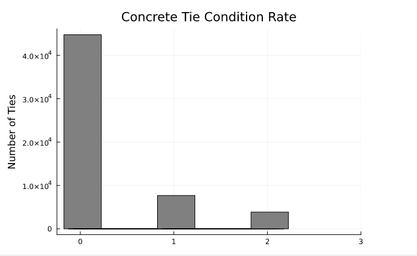
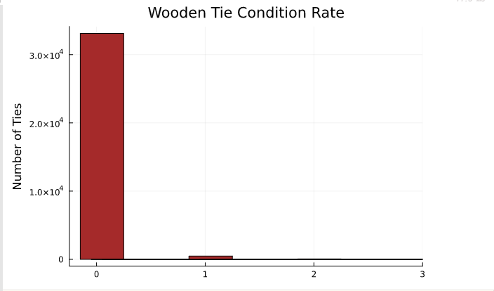
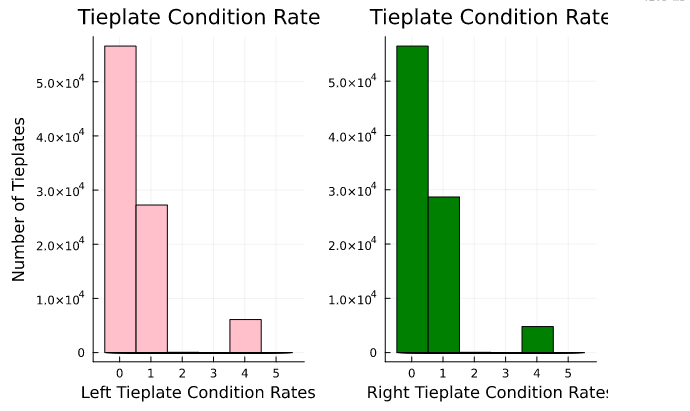
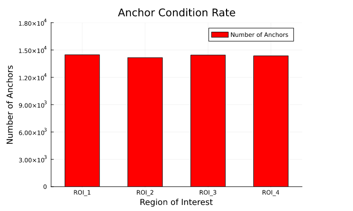
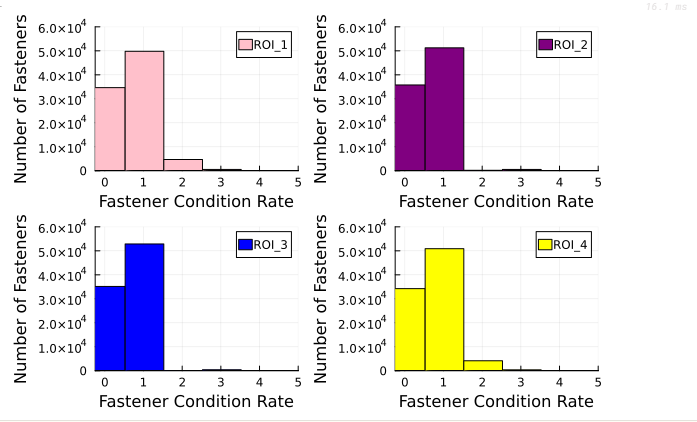
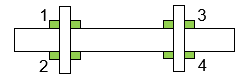
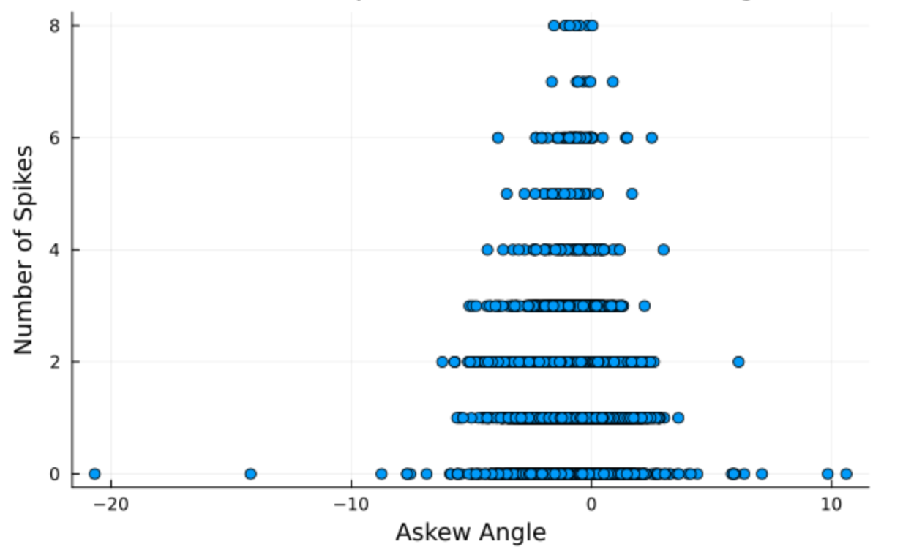
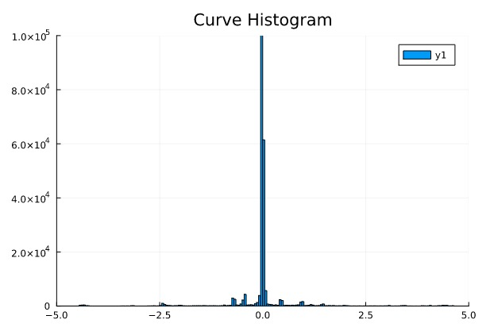

---
title: Relationship Between Track Tie Situation and Its Components Health Conditions
keywords:
- markdown
- publishing
- manubot
lang: en-US
date-meta: '2022-10-31'
author-meta:
- Arthur Bilheri
- Negin Shafie
- Shirin Qiam
- Sadaf Shafie
header-includes: |-
  <!--
  Manubot generated metadata rendered from header-includes-template.html.
  Suggest improvements at https://github.com/manubot/manubot/blob/main/manubot/process/header-includes-template.html
  -->
  <meta name="dc.format" content="text/html" />
  <meta name="dc.title" content="Relationship Between Track Tie Situation and Its Components Health Conditions" />
  <meta name="citation_title" content="Relationship Between Track Tie Situation and Its Components Health Conditions" />
  <meta property="og:title" content="Relationship Between Track Tie Situation and Its Components Health Conditions" />
  <meta property="twitter:title" content="Relationship Between Track Tie Situation and Its Components Health Conditions" />
  <meta name="dc.date" content="2022-10-31" />
  <meta name="citation_publication_date" content="2022-10-31" />
  <meta name="dc.language" content="en-US" />
  <meta name="citation_language" content="en-US" />
  <meta name="dc.relation.ispartof" content="Manubot" />
  <meta name="dc.publisher" content="Manubot" />
  <meta name="citation_journal_title" content="Manubot" />
  <meta name="citation_technical_report_institution" content="Manubot" />
  <meta name="citation_author" content="Arthur Bilheri" />
  <meta name="citation_author_institution" content="Hogwarts school of witchcraft" />
  <meta name="citation_author_orcid" content="XXXX-XXXX-XXXX-XXXX" />
  <meta name="twitter:creator" content="@I dont like birds" />
  <meta name="citation_author" content="Negin Shafie" />
  <meta name="citation_author_institution" content="Department of Civil and Environmental Engineering, University of Illinois at Urbana-Champaign" />
  <meta name="citation_author_orcid" content="XXXX-XXXX-XXXX-XXXX" />
  <meta name="twitter:creator" content="@NA" />
  <meta name="citation_author" content="Shirin Qiam" />
  <meta name="citation_author_institution" content="Department of Civil and Environmental Engineering, University of Illinois at Urbana-Champaign" />
  <meta name="citation_author_orcid" content="XXXX-XXXX-XXXX-XXXX" />
  <meta name="twitter:creator" content="@NA" />
  <meta name="citation_author" content="Sadaf Shafie" />
  <meta name="citation_author_institution" content="Department of Civil and Environmental Engineering, University of Illinois at Urbana-Champaign" />
  <meta name="citation_author_orcid" content="XXXX-XXXX-XXXX-XXXX" />
  <meta name="twitter:creator" content="@NA" />
  <link rel="canonical" href="https://uiceds.github.io/cee-492-term-project-fall-2022-shans/" />
  <meta property="og:url" content="https://uiceds.github.io/cee-492-term-project-fall-2022-shans/" />
  <meta property="twitter:url" content="https://uiceds.github.io/cee-492-term-project-fall-2022-shans/" />
  <meta name="citation_fulltext_html_url" content="https://uiceds.github.io/cee-492-term-project-fall-2022-shans/" />
  <meta name="citation_pdf_url" content="https://uiceds.github.io/cee-492-term-project-fall-2022-shans/manuscript.pdf" />
  <link rel="alternate" type="application/pdf" href="https://uiceds.github.io/cee-492-term-project-fall-2022-shans/manuscript.pdf" />
  <link rel="alternate" type="text/html" href="https://uiceds.github.io/cee-492-term-project-fall-2022-shans/v/e54c6bc27c7bf548ee2599b8405b84c92af2a16e/" />
  <meta name="manubot_html_url_versioned" content="https://uiceds.github.io/cee-492-term-project-fall-2022-shans/v/e54c6bc27c7bf548ee2599b8405b84c92af2a16e/" />
  <meta name="manubot_pdf_url_versioned" content="https://uiceds.github.io/cee-492-term-project-fall-2022-shans/v/e54c6bc27c7bf548ee2599b8405b84c92af2a16e/manuscript.pdf" />
  <meta property="og:type" content="article" />
  <meta property="twitter:card" content="summary_large_image" />
  <link rel="icon" type="image/png" sizes="192x192" href="https://manubot.org/favicon-192x192.png" />
  <link rel="mask-icon" href="https://manubot.org/safari-pinned-tab.svg" color="#ad1457" />
  <meta name="theme-color" content="#ad1457" />
  <!-- end Manubot generated metadata -->
bibliography:
- content/manual-references.json
manubot-output-bibliography: output/references.json
manubot-output-citekeys: output/citations.tsv
manubot-requests-cache-path: ci/cache/requests-cache
manubot-clear-requests-cache: false
...

<small><em>
This manuscript
([permalink](https://uiceds.github.io/cee-492-term-project-fall-2022-shans/v/e54c6bc27c7bf548ee2599b8405b84c92af2a16e/))
was automatically generated
from [uiceds/cee-492-term-project-fall-2022-shans@e54c6bc](https://github.com/uiceds/cee-492-term-project-fall-2022-shans/tree/e54c6bc27c7bf548ee2599b8405b84c92af2a16e)
on October 31, 2022.
</em></small>

## Authors

+ **Arthur Bilheri** 
    {.inline_icon}
    [XXXX-XXXX-XXXX-XXXX](https://orcid.org/XXXX-XXXX-XXXX-XXXX)
    · {.inline_icon}
    [artbil94](https://github.com/artbil94)
    · {.inline_icon}
    [I dont like birds](https://twitter.com/I dont like birds) 
  <small>
     Hogwarts school of witchcraft
  </small>

+ **Negin Shafie** 
    {.inline_icon}
    [XXXX-XXXX-XXXX-XXXX](https://orcid.org/XXXX-XXXX-XXXX-XXXX)
    · {.inline_icon}
    [negins2](https://github.com/negins2)
    · {.inline_icon}
    [NA](https://twitter.com/NA) 
  <small>
     Department of Civil and Environmental Engineering, University of Illinois at Urbana-Champaign
     · Funded by none
  </small>

+ **Shirin Qiam** 
    {.inline_icon}
    [XXXX-XXXX-XXXX-XXXX](https://orcid.org/XXXX-XXXX-XXXX-XXXX)
    · {.inline_icon}
    [Shirin-qiam](https://github.com/Shirin-qiam)
    · {.inline_icon}
    [NA](https://twitter.com/NA) 
  <small>
     Department of Civil and Environmental Engineering, University of Illinois at Urbana-Champaign
     · Funded by none
  </small>

+ **Sadaf Shafie** 
    {.inline_icon}
    [XXXX-XXXX-XXXX-XXXX](https://orcid.org/XXXX-XXXX-XXXX-XXXX)
    · {.inline_icon}
    [sadafs2](https://github.com/sadafs2)
    · {.inline_icon}
    [NA](https://twitter.com/NA) 
  <small>
     Department of Civil and Environmental Engineering, University of Illinois at Urbana-Champaign
     · Funded by none
  </small>

## Introduction {.page_break_before}

Railroad tracks have four main components: rail, ties, fastening systems, and ballast. The rail is the main component that supports the loads transmitted by the trains. The fastening system is responsible for fastening the rail to the ties and keeping the rail in a proper position. Fastening systems are made of spikes, tie plates, anchors, and sometimes clips. The ties are the interface between the rails and ballast. The two main materials used for ties in the United States are timber and concrete. The last layer on the railroad superstructure is the ballast. Its main functions are to spread the loads on the ground and to provide proper drainage for the track system. 

These components are inspected using the LRAIL technology that combines 2D imagery and laser triangulation to assess the health and condition of each component. The collected data is processed through a DNN (Deep Convolutional Neural Network) model that identifies and classifies the components. This technology has been used under the scope of research led by the RailTEC group at UIUC, funded by the FRA-DOT with two Class I railroads in the US. The output of this technology, which will be used in this project, is described in an Excel file (filename: Datasets) attached to this proposal and Table 1. 

Track geometry can be defined as the relative position of the rails. The common measurements are related to horizontal and vertical irregularities, gage, and superelevation. CFR 213 establishes safety limits that must be kept in order to provide the trains with a safe ride.
Railroads use laser-based contactless systems to measure track geometry. Recently these systems have been installed in boxcars and locomotives to provide autonomous measurements, reduce inspection costs, and collect more data. Geometry cars, as they are called, collect measurements of each foot of the track to calculate the deviations.

The purpose of this project is to look for relationships between components’ health and geometry data collected over the same tracks in a short period and to identify possible correlations. The approaches of this project consist of but are not limited to EDA methods, regressions, and correlation models. The data can be found in [Project](https://uillinoisedu-my.sharepoint.com/:f:/g/personal/arthurc4_illinois_edu/Eh9aZN9IoCJHvQiN_xHw2K0BBja-OZrkBTgf1JRtKFdTUw?e=yHjPx7) , “LRAIL” contains the component health conditions,  “Geometry 1” and “Geometry 2” include the geometry data for that same track, and “Datasets” describes each of the above.  

Table 1: Description of data

| **Column name** | **Type** | **Range** | **Unit** | **Observation** |
|---|---|---|---|---|
| SectionID | int | 0-inf |  | The ID number of section containing the tie. Each section is 2m wide.  |
| Distance_m | float | 0-inf | meters | The position of the tie. The distance is computed from the beginning of the survey. The unit is meter |
| Material | string | Wooden, Concrete |  | The material of the tie |
| Rating | int | 0-3 (Wooden)  0-2 (Concrete) |  |  The rating of tie based on condition of crack on surface of tie. 0: good. 3 or 2 is bad. |
| Askew_Angle | float | -inf to inf | degrees | Askew angle of the tie. This is angle between the horizontal line and the center line of the tie (passing through middle of tie)  positive if we need to rotate the tie clockwise to make the center line fit the horizontal line and it is negative if we need to rotate the tie counter-clockwise. The unit is degrees. |
| FastenerConditionROI_1 | int | 1, 2, 3, 20 |  | The condition of fastener in ROI 1 to 4. 1: Good, 2: Covered, 3: Missing and 20: Defective |
| SpikeTotalROI_1 to 4 | int | 0-inf |  | Number of spike in each ROI on tie |
| SpikeMean_Height_ROI1_mm | float | 0-inf | milimeters | The mean height of all tie in each ROI on tie. The unit is millimeter |
| SpikeNearRailROI_1 | int | 0-inf |  | Number of spike is near the rail boundary in each ROI on tie |
| AnchorROI_1 | int | 0-inf |  | Number of anchor in each ROI (relating to the tie) |
| Tieplate_Right | int | 0-inf |  | Number of tieplate on left/right side of tie |
| TieplateCondition_Right | int | 1-5 |  | Condition of tieplate. 1: Good, 2: Sunken, 4: Covered, 5: Twisted |
| Latitude | float | -90 to +90 | degrees | GPS coordinates of the center of the tie |
| Longitude | float | -90 to +90 | degrees | GPS coordinates of the center of the tie |

## Exploratory Data Analysis {.page_break_before}
### Statistical Analysis on Track Elements-Tie
In this project, we are studying a rail track with multiple elements. In this section, we study some of the most important elements that help us build our understanding of the track system. We started with ties.  There are two types of ties in the track under study: concrete ties, and wooden ties. Figure {#fig:TieMaterial} shows the total number of each tie material. The total number of ties is 89985.  62.5 percent of the ties are made of concrete (56295 ties) and the remaining 37.5 percent are wooden ties (33690 ties).

{#fig:TieMaterial}

The data set provides condition ratings for each type of tie. Figure {#fig:concretecon}  illustrates the distribution of different tie conditions for concrete ties. the rating goes from 0 to 2. Zero represents the good tie condition, and 2 represents the worst tie condition. To create this figure, first, we filtered the data frame to get rid of the wooden ties. Next, we plotted the histogram of the concrete tie ratings to get the number of ties with different conditions. In the end, we calculated each condition rate's percentage to better understand our tie health rate. The percentages are as follows: 79.5% of the ties are labeled as 0 (good), 13.5% have a rating of 1, and the remaining 7% are in poor condition. 

{#fig:concretecon}

The same process was done to get the health condition of wooden ties. Figure 3 shows the distribution of wooden tie ratings. The only difference between concrete and wooden tie ratings is we have a 3rd rate for wooden ties which represent the most damaged ties. figure 3 illustrates wooden tie condition ratings. The percentages of different condition rates are as follows:  98% of the ties are labeled as 0 (good), 1.5 % are 1, and the remaining 0.5% are in poor condition (2 and 3). These figures suggest that the overall condition of wooden ties is better than concrete ties. 
{#fig:woodcon}
Moving forward to the next elements of the track: tie plates, anchors, and spikes. It is worth noting that concrete ties don’t require any of the mentioned components, which means this section of the project only focuses on wooden ties. we will get back to the concrete ties later in this deliverable.
### Statistical Analysis on Track Elements-Tieplate
Our data set describes tie plate existence, along with their conditions. The condition of each tie is represented by a single rating value in the range of 1 to 5, 1 being the good tie plate condition, 2 meaning the plate is sunken, 3 meaning the plate is mildly damaged, 4 meaning the plate is covered, and lastly, 5 means the plate is twisted. To analyze the overall condition of tie plates, we counted the number of existing tie plates in right and left sides of the ties. To do so, first, we filtered out the rows of our data frame where the tie plate didn’t exist. Our results show that a total number of 33517 tie plates exist on the right side of the ties, and 33397 tie plates exist on the left side of the ties. As mentioned earlier, the total number of wooden ties is 33690. This means about 0.7% of the ties miss at least one tie plate. A total of 214 wooden ties, don’t have any tie plates, which is about 0.6% of the wooden ties. 
Following the same methodology explained under ties, we plotted the histogram of different tie plate conditions for each side of the ties. On the right side of figure {#fig:tieplate}, the distribution of right tie plate conditions is shown, and the left side illustrates the left tie plate conditions. 

{#fig:tieplate}

### Statistical Analysis on Track Elements-Anchor
We have four regions of interest on track, two on the left-hand side and two on the right side of each tie. This will be discussed in more detail further on the project. There are 4 channels in our data frame describing the anchors in each of the regions. In this section, we counted the number of existing anchors in each region, along with plotting their distribution. To do so, we selected the 4 channels from the data frame, then we filtered each region of interest to use in our calculations. And lastly, we plotted the bar chart of our selected channels. Given the fact that wooden ties require anchors on every other tie, we expect to have around 16850 anchors on the track. Based on our calculations there are 14470 anchors in the first region of interest, 14159 in the second one, 14444 in the third one, and 14355 in the last region. On average, 42% of the wooden ties have anchors on them (8% less than our expectations). Figure {#fig:anchorr} illustrates this.

{#fig:anchorr}

### Statistical Analysis on Track Elements-Fastener
Our data frame describes the condition of the fasteners in each region of interest in 4 different channels, each belonging to one region. The condition rating is 1,2,3, or 20. 1 means the fastener is in good condition, 2 means the fastener is covered, 3 means the fastener is missing, and 20 means it is defective. To analyze our data, first, we selected 4 channels corresponding to fasteners from our data frame, then we filtered each region of interest to analyze them separately. We plotted the histogram of the fastener condition of each of the regions, then plotted all 4 plots together, which can be seen in Figure {#fig:fastener}. 

{#fig:fastener}

### Does Askew Angle relate to the number of anchors?
Anchors are spring steel clips that attach to the underside of the rail baseplate and bear against the sides of the sleepers to prevent longitudinal movement of the rail, either from changes in temperature or through vibration. Based on the definition of askew angle in table 1, the anchors may have a relationship with the askew angle.  Figure @fig:Anchor shows regions of interest 1 to 4 for anchors. The following parts describe the steps we do to investigate any relationship between the askew angle and the number of anchors in a tie. 

{#fig:Anchor}

<u> Selecting related columns: </u>  

To create the data frame, using the "select" function in Julia, we select columns about askew angle and anchors, which are "Askew_Angle", "Material", "AnchorROI_1", "AnchorROI_2", "AnchorROI_3", "AnchorROI_4". The material is important because we only have anchors for wooden ties. Therefore, the data frame has 89982 rows and six columns.

<u> Filtering wooden ties: </u> 

Using the "filter" function, we choose only ties with wooden material. The new data frame for wooden ties has 33687 columns which shows more than half of the ties are concrete. 

<u> Adding total number of anchors: </u> 

Since we have only 0 or 1 for having or not having an anchor in the raw data, we need to know the total number of anchors for each tie. Therefore, we add a column to our data frame representing the total number of anchors for each tie by adding columns for anchors in each ROI. 

<u> Describing statistical features of data: </u> 

The "describe" function gives a good overview of the statistical features of the data frame. Using this function, we find the statistics for our data. Figure @fig:describe_anc_ask represents the result. 

{#fig:describe_anc_ask height=2in}

<u> Plotting corrplot for data: </u> 

The first thing we can plot to check whether some variables are correlated or not is a corrplot. Figure @fig:corrplot_anc_ask shows the corrplot for the data. 

{#fig:corrplot_anc_ask height=4in}

The corrplot indicates that there is no correlation between askew angle and anchors. However, this idea comes to mind that comparing the statistics for situations with a different total number of anchors assures us that we don't have any relationship between askew angle and anchors. Therefore, we filter the data based on each value we can have as the total number of anchors (0 to 4) and find their distribution of askew angle using the "histogram" function. 

<u> Plotting histogram for different values of total number of anchors: </u> 

Plotting all five histograms in a graph shows us that they are so close and different numbers anchors have not caused different askew angles. Figure @fig:hist_all_ask_anc shows these histograms. 

{#fig:hist_all_ask_anc height=2in}

Different numbers of bins are because of the different numbers of data we have in each situation. To make our conclusion more precise, we normalize the data and compare situations with no anchor and 4 anchors. Figure @fig:norm_histask_anc represents no meaningful difference between these two conditions. 

{#fig:norm_histask_anc height=2in}

<u> Plotting boxplot: </u> 

The last graph we plot is a boxplot which provides a good sense of statistics to compare skew angle with different total numbers of anchors. Figure @fig:bo_ask_anc shows these boxplots and confirms no such difference between the mean and other statistics of askew angle.

{#fig:bo_ask_anc height=2in}

<u> Conclusion: </u>

Even though the anchors seem to play a significant role for the askew angle, the data surprisingly shows they do not have any relationship. 

### Does Askew Angle relate to the number of spikes?

As what we had for anchors, we are interested in finding a relationship between spike conditions and askew angle. The steps to figure out this relationship is as follows. 

<u> Selecting related columns: </u>  

To create the data frame, we select columns about askew angle and spikes, which are "Askew_Angle", "SpikeTotalROI_1", "SpikeMean_Height_ROI1_mm", "SpikeNearRailROI_1", and these last three coulmns for ROI 2, ROI 3, and ROI 4. Therefore, the data frame has 89982 rows and 13 columns.

<u> Plotting corrplot for data: </u> 

The first thing we can plot to check whether some variables are correlated or not is a corrplot. Figure @fig:corr_ask_spi shows the corrplot for ROI 1. As the corrplot for other regions of interest are similar to ROI 1, we do not put it on the report. For the rest of this part, we just consider ROI 1 because the results are the same for all the regions. 

{#fig:corr_ask_spi height=4in}

Like anchors, the corrplot indicates no correlation between askew angle and spike conditions. However, an interesting pattern can be seen in the scatter plots we have in corrplot. To illustrate this pattern better, figure @fig:scatt_ask_spi shows a scatter plot for the number of spikes in ROI1 and askew angle, which is one of the plots in corrplot. We can see that the range of the askew angle for fewer spikes is larger. It is reasonable and having no correlation between askew angle and spike condition is because a large share of ties are healthy and do not have defective spikes. However, the unsatisfactory situation is crucial for us. Therefore, as the askew angle is approximately symmetric relative to zero, we consider the maximum askew angle for the different numbers of spikes and find the correlation between it and the number of spikes. 

{#fig:scatt_ask_spi height="50%"}

<u> Correlation between maximum askew angle and the number of spikes: </u> 

Using "corr" function, we find the correlation value between the maximum askew angle and the number of spikes which is about -0.64. Therefore, we say they are correlated, and there is a relationship between the maximum askew angle and the number of spikes. The same results happen for other regions of interest and even the total number of spikes in all regions.   

<u> Relationship between Gauge Deviation and Concrete Tie Rating </u>

During the EDA section we tried to look for relationships between the gauge of the track and the component’s condition. The Gauge Deviation is the difference between the standard gauge (4’-8.5”) and the measured gauge. So a value close to 0 indicates that the gauge is correct. Due to the train traffic and tie degradation the gauge deviation tends to increase over time. When it reaches certain limits, it is called a defect and maintenance must be made to restore the gauge. Negative values usually mean that the tie was installed with a tighter gauge or that there was a measurement error and should be considered outliers if it is too tight, around -1 in or less.
To be reasonable in this section, the analysis are divided between concrete and Wooden ties, since they have different characteristics that make it harder compare both together.
The most directly relationship is the gauge of the track and the condition of the ties. Based on the technology used the concrete ties are graded from 0 (Good) to 2 (Bad). 1 (Fair) is a intermediate condition. The following graph represents the distribution of gauge deviation by each concrete tie rating.

Intuitively we can think that bad ties would have wide gauge, but for this specific region it is not the case. Comparing the median values we see that the values are not too far from each other. Another interesting finding is that the max value does not have big changes when changing the tie rating, indicating that any tie rating can have a gauge defect.

<u> Relationship between Gauge Deviation and Wooden Tie Rating </u>

Now let’s look to the same criteria but for Wooden ties. Wooden ties have one more bin for classification, still following the same idea as 0 being Good and 3 being Bad. The following graph shows the distribution of gauge deviation by each wooden tie rating.

First thing to mention is that the Good ties (Condition 0) has more outliers than the other ones, this can be related to the fact that there are a lot more ties with this condition than the other ones. In contrast to the concrete ties, the median gets slightly higher when we have a bad condition tie, indicating that the condition of the tie can be related to the gauge of the track. Comparing the max values, only condition zero (Good) and 3 (Bad) have higher max values. It makes sense for condition 3 (Bad) ties but measurement errors should be account for condition 0 (Good) ties.

<u> Relationship between Gauge Deviation and Tie Plate Condition </u>

The next component to be investigated is the tie plate. Only wooden ties have tie plates. Their main function is to support the rail and distribute the load on the ties. Normal wooden ties have two tie plates – one per rail. The metric used to analyze the data is the number of defective tie plates per tie, 0 being a tie with 2 tie plates and 2 a tie plate without tie plates in good condition. The following graph shows the distribution of gauge deviation by the number of defectives tie plates per wooden tie.

Again, the number of outliers for ties with two tie plates must be taken into consideration since this is the highest population on the dataset. The main takeaway is that the number of defective tie plates are not directly related to the gauge.

<u> Relationship between Gauge Deviation and Number of Defective Fasteners on Wooden Ties </u>

Fasteners are the components that have hold down force to hold the rails connected to the tie plates. They are used in very specific situations in the railroad, such as tight curves, switches and grade crossings. When used, each tie has four fasteners, two per rail, one on each side of the rail. Fasteners may or may not used in wooden ties but must be used in concrete ties. The following graph shows the distribution of gauge deviation by the number of defectives fasteners per wooden tie.

Outside the outliers for ties without any defective fasteners, ties with only two defective fasteners have more variability in gauge. It can be explained by the fact that if the two missing fasteners are on the outside side of the rails, it is likely that the gauge will be widened. The ties with 3 and 4 bad fasteners are not that common, but when they happen they have wider gauge than the ties in better condition. Only one bad fastener does not have much influence in the gauge.
 
 <u> Relationship between Gauge Deviation and Number of Defective Fasteners on Concrete Ties </u>
 
For concrete ties there were no ties with zero defective fasteners (all four fasteners present) or with 4 defective fasteners (no fasteners at all). That can be related to the fact of having less concrete ties in the section analyzed. The following graph shows the distribution of gauge deviation by the number of defectives fasteners per concrete tie.
 
 
 
Concrete ties are less prone to have gauge problems related to defective fasteners, as we can see by comparing the median of the distributions. It can be explained by the fact that they have metal shoulders that holds the rails in place, regardless of having a fastener or not. Concrete ties with 3 defective fasteners are more prone to have wide gauge, as shown by the higher median than the other conditions.

### Is there a meaningful relation between the Degree of Curvature and Tie Condition?

Degree of curvature is a measure to determine the sharpness of a curve. The definition is found by connecting two points on an arc with a 100-foot chord, drawing radii from the center of the arc to the chord end-points, and then measuring the angle between these radii lines. The larger the degree of curvature, the sharper the curve is. A positive degree of curvature means the track route is towards right, and a negative degree of curvature represents a left turn. 
So far, we know that there are two different tie materials in our data set with different condition rating ranges and overall characteristics. To perform a reasonable analyze, we split the dataset into two, one containing wooden ties, and the other including concrete ties. We also had to create a dataframe whit both geometry and Lrail data. To do so, we used Julia function innerjoin, and then filtered the dataset to eliminate no-curved track. 
Box plots for concrete tie is shown below in {#fig:Concrete_curve}. Concrete tie rates ranges from 0 (good) to 1(fair), and 2 (bad). 
The median values showed with the lines inside each box indicate that bad ties correspond to higher curvature degrees compared to good ties. But, the range of curve for each tie rating tells us the good ties are not limited to parts of the track with only high degrees of curvature. 

{#fig:Concrete_curve}

Box plots for wooden ties is shown below in {#fig:Wooden_curve}. Wooden tie rates ranges from 0 (good) to 3 (bad). This plot shows that most of bad wooden ties are located in the parts of the railroad with a higher curvature degree compared to good wooden ties. But, like what we saw in Concrete ties, the range of each box 
shows That curvature is not the only participating factor in tie deterioration. 

{#fig:Wooden_curve}

### Is there a meaningful relation between the Degree of Curvature and Number of Spikes per Tie?

We know that spikes are only used for wooden ties, therefore we filtered all wooden ties. Next, we know that we have the number of spikes in each Region of interest but we need the total number of spikes per tie, so we created a new column with the total number of spikes per tie in it, and added it to our filtered data frame. Figure below shows a box plot, in which the medians show an increase in curvature degree for higher spike numbers. Which is true, since ties and rail need more stability and lateral resistance in sharper curves. Although, the first box from the left is not covering a great range of curvature degrees, it is still considered not desirable since all the spikes are missing. 

{#fig:Spike_Curve}

### Is there a meaningful relation between the Degree of Curvature and Gauge?
First, we looked at the correlation plot shown in figure {#fig:curve_gauge} to investigate a possible relationship between the Degree of Curvature and Gauge. We used the absolute value of the curvature here to make the resultant plot more accurate. 

{#fig:curve_gauge}

The correlation plot shows a slight positive correlation, meaning the greater the degree of curvature or in other words, for sharper curves, the changes in gauge are greater. 
By looking at the Curve histogram, shown in figure {#fig:Curve_Histogram} , we realized that the majority of this specific rail track is on a straight route with 0 degree of curvature. Also, the Gauge histogram in {#fig:Gauge_Histogram} suggests that a significant percentage of the measured gauges, are actually in good condition. But, since we are interested in the parts of the track with a considerable curvature or bad gauge, we decided to look at positive and negative curvature separately, and the results were not what we assumed would be.  

{#fig:Gauge_Histogram}

{#fig:Curve_Histogram}

Despite our initial assumption the absolute value of curvature does not provide more accurate results, while the correlation between negative curvature and gauge is greater than the one for positive curves. The correlation also was calculated using corr function in Julia. The Pearson correlation for positive curves and gauge is 0.27, while it is -0.42 for negative curves and gauge. 
Although we do not know what is causing this difference, this is an interesting finding and can be further discussed.

{#fig:Neg_curve}

{#fig:Pos_Curve}

### Predictive Modeling
As our next step, we want to use this dataset and the information we gained about it to develop a predictive model. Our goal is to identify track degradation predictors and their contribution weight to the overall degradation. By doing so, we can know about the probable defects in track before they actually happen, which is categorized as preventive maintenance practice. This maintenance method is more cost-efficient and can aim the railroad companies in better allocating their resources. 

## References {.page_break_before}

<!-- Explicitly insert bibliography here -->

